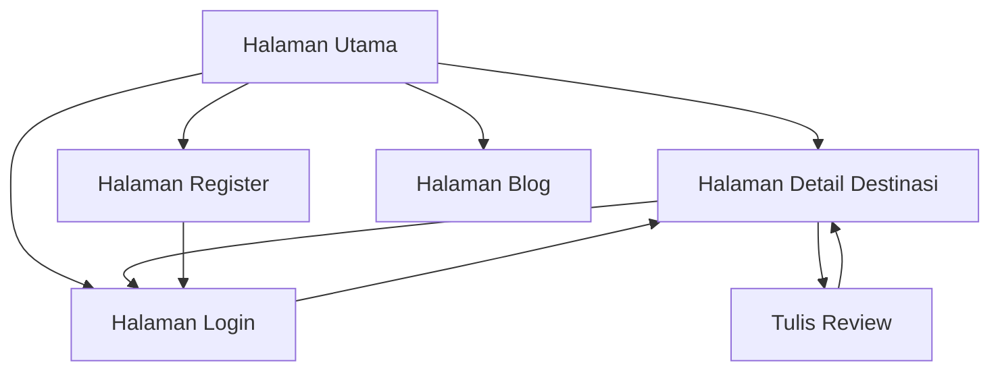

## 1. Product Overview
Website trip advisor lokal yang memungkinkan pengguna menelusuri destinasi wisata, membaca review, dan berbagi pengalaman perjalanan. Platform ini membantu traveler menemukan tempat terbaik untuk dikunjungi dengan fitur perubahan mata uang dan kategori kegiatan yang lengkap.

Target pengguna: traveler domestik dan internasional yang mencari informasi akurat tentang destinasi wisata Indonesia.

## 2. Core Features

### 2.1 User Roles
| Role | Registration Method | Core Permissions |
|------|---------------------|------------------|
| Pengguna Biasa | Email atau Google OAuth | Melihat destinasi, membaca review, menulis review |
| Pengguna Premium | Upgrade melalui pembayaran | Akses eksklusif content, review prioritas |
| Admin | Registrasi khusus | Mengelola konten, moderasi review |

### 2.2 Feature Module
Website ini terdiri dari halaman-halaman utama berikut:
1. **Halaman Utama**: pencarian destinasi, kategori kegiatan (outdoor, makanan, budaya), review terbaru, dan fitur ganti mata uang.
2. **Halaman Detail Destinasi**: informasi lengkap destinasi, review pengguna, rating, foto-foto, dan kegiatan yang tersedia.
3. **Halaman Login**: formulir login dengan email atau Google OAuth.
4. **Halaman Register**: formulir pendaftaran baru dengan validasi data.
5. **Halaman Blog**: artikel perjalanan, tips wisata, dan cerita pengalaman.

### 2.3 Page Details
| Page Name | Module Name | Feature description |
|-----------|-------------|---------------------|
| Halaman Utama | Hero Section | Tampilkan gambar destinasi populer dengan teks inspiratif dan tombol call-to-action. |
| Halaman Utama | Search Bar | Memungkinkan pencarian destinasi berdasarkan nama, lokasi, atau kategori. |
| Halaman Utama | Kategori Kegiatan | Menampilkan kartu-kartu kategori: outdoor, makanan, budaya, petualangan, relaksasi. |
| Halaman Utama | Review Terbaru | Daftar review terbaru dari pengguna dengan rating dan foto thumbnail. |
| Halaman Utama | Currency Switcher | Dropdown untuk mengganti mata uang antara USD dan IDR dengan konversi real-time. |
| Halaman Detail Destinasi | Informasi Utama | Nama destinasi, lokasi, rating keseluruhan, jumlah review, dan deskripsi singkat. |
| Halaman Detail Destinasi | Galeri Foto | Carousel foto-foto destinasi dengan thumbnail navigation. |
| Halaman Detail Destinasi | Daftar Review | Review dari pengguna dengan rating, foto, tanggal kunjungan, dan konten review. |
| Halaman Detail Destinasi | Formulir Review | Form untuk menulis review baru dengan rating bintang, upload foto, dan text editor. |
| Halaman Detail Destinasi | Kegiatan Tersedia | Daftar kegiatan yang bisa dilakukan di destinasi tersebut dengan harga dalam mata uang yang dipilih. |
| Halaman Login | Form Login | Input email dan password dengan validasi client-side menggunakan Zod. |
| Halaman Login | Google OAuth | Tombol login dengan akun Google untuk kemudahan akses. |
| Halaman Login | Link Register | Tautan ke halaman pendaftaran untuk pengguna baru. |
| Halaman Register | Form Register | Input nama lengkap, email, password, dan konfirmasi password. |
| Halaman Register | Validasi | Validasi email unik, password strength, dan matching confirmation. |
| Halaman Register | Terms Checkbox | Checkbox untuk menyetujui syarat dan ketentuan. |
| Halaman Blog | Daftar Artikel | Kartu-kartu artikel dengan thumbnail, judul, penulis, dan tanggal publikasi. |
| Halaman Blog | Filter Kategori | Filter artikel berdasarkan kategori: tips, cerita, rencana perjalanan. |
| Halaman Blog | Artikel Detail | Halaman membaca artikel lengkap dengan gambar, konten, dan author bio. |

## 3. Core Process
**Flow Pengguna Biasa:**
Pengguna mengunjungi halaman utama → melakukan pencarian destinasi → melihat detail destinasi → membaca review → memutuskan untuk login → menulis review → logout.

**Flow Pengguna Baru:**
Pengguna baru mengklik tombol register → mengisi formulir pendaftaran → verifikasi email → login berhasil → mulai menjelajahi destinasi.

## 4. User Interface Design

### 4.1 Design Style
- **Warna Utama**: Deep blue (#1E40AF) untuk kepercayaan dan ketergantungan
- **Warna Sekunder**: Warm orange (#F97316) untuk energi dan petualangan
- **Button Style**: Rounded-lg dengan shadow hover effect
- **Font**: Inter untuk heading, Open Sans untuk body text
- **Layout**: Card-based dengan grid system responsive
- **Icon Style**: Heroicons outline untuk konsistensi

### 4.2 Page Design Overview
| Page Name | Module Name | UI Elements |
|-----------|-------------|-------------|
| Halaman Utama | Hero Section | Full-width background image dengan overlay gradient, heading besar (text-4xl), CTA button dengan warna orange. |
| Halaman Utama | Search Bar | Input field dengan icon pencarian, dropdown lokasi, dan tombol search dengan warna primary. |
| Halaman Utama | Kategori Kegiatan | Grid 3x2 pada desktop, 2x3 pada mobile, card dengan icon besar dan nama kategori. |
| Halaman Detail Destinasi | Header | Sticky navigation dengan breadcrumb, tombol share, dan currency switcher di pojok kanan. |
| Halaman Detail Destinasi | Rating Section | Bintang berwarna kuning, angka rating besar (text-3xl), dan jumlah review. |
| Halaman Login | Form Container | Card putih dengan shadow-xl, max-width 400px, centered pada halaman. |

### 4.3 Responsiveness
Desktop-first approach dengan breakpoint:
- Desktop: 1280px dan lebih besar
- Tablet: 768px - 1279px
- Mobile: kurang dari 768px

Touch interaction optimization untuk mobile dengan tombol yang cukup besar (min-height 44px) dan swipe gesture untuk image carousel.