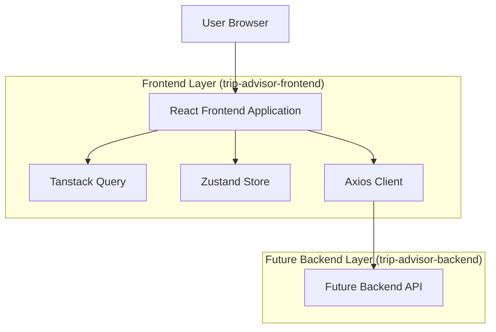
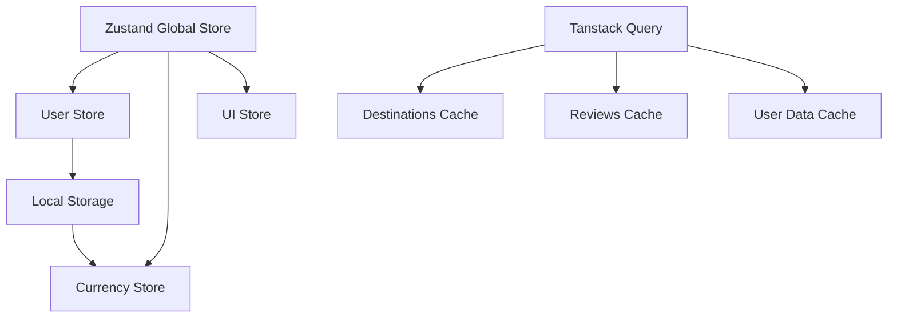

## 1. Architecture design



## 2. Technology Description
- **Frontend**: React@18 + Tanstack Router + Tanstack Query + Zustand + Zod + Tanstack Form + ShadCN UI + Tailwind CSS v4
- **Initialization Tool**: vite-init
- **HTTP Client**: Axios
- **State Management**: Zustand untuk global state, Tanstack Query untuk server state
- **Validation**: Zod untuk form validation dan type safety
- **UI Components**: ShadCN UI dengan Tailwind CSS v4
- **Backend**: None (akan dibuat terpisah di folder trip-advisor-backend)

## 3. Route definitions
| Route | Purpose |
|-------|---------|
| / | Halaman utama dengan pencarian destinasi dan kategori kegiatan |
| /destination/:id | Halaman detail destinasi dengan review dan informasi lengkap |
| /login | Halaman login dengan email dan Google OAuth |
| /register | Halaman pendaftaran pengguna baru |
| /blog | Halaman daftar artikel blog |
| /blog/:slug | Halaman detail artikel blog |
| /profile | Halaman profil pengguna (akan dibuat setelah auth backend) |

## 4. API definitions (Future Implementation)

### 4.1 Authentication API
```
POST /api/auth/login
```

Request:
| Param Name | Param Type | isRequired | Description |
|------------|------------|------------|-------------|
| email | string | true | Email pengguna |
| password | string | true | Password pengguna |

Response:
| Param Name | Param Type | Description |
|------------|------------|-------------|
| token | string | JWT token untuk autentikasi |
| user | object | Data pengguna yang login |

### 4.2 Destinations API
```
GET /api/destinations
```

Query Parameters:
| Param Name | Param Type | isRequired | Description |
|------------|------------|------------|-------------|
| search | string | false | Pencarian nama destinasi |
| category | string | false | Filter berdasarkan kategori |
| limit | number | false | Jumlah item per halaman |
| offset | number | false | Offset untuk pagination |

### 4.3 Reviews API
```
POST /api/reviews
```

Request:
| Param Name | Param Type | isRequired | Description |
|------------|------------|------------|-------------|
| destinationId | string | true | ID destinasi |
| rating | number | true | Rating 1-5 |
| content | string | true | Isi review |
| photos | array | false | Array URL foto |

## 5. Project Structure
```
trip-advisor-frontend/
├── src/
│   ├── components/
│   │   ├── ui/          # ShadCN UI components
│   │   ├── common/      # Components reusable
│   │   └── features/    # Feature-specific components
│   ├── pages/           # Page components
│   ├── hooks/           # Custom React hooks
│   ├── lib/             # Utilities, validators, configs
│   ├── stores/          # Zustand stores
│   ├── services/        # API service functions
│   ├── types/           # TypeScript type definitions
│   └── routes.tsx       # Tanstack Router configuration
├── public/
├── package.json
├── tsconfig.json
├── vite.config.ts
├── tailwind.config.js
└── README.md
```

## 6. Data Model (Frontend Types)

### 6.1 Destination Type
```typescript
interface Destination {
  id: string;
  name: string;
  location: string;
  description: string;
  rating: number;
  reviewCount: number;
  categories: string[];
  photos: string[];
  activities: Activity[];
  priceRange: {
    min: number;
    max: number;
    currency: 'USD' | 'IDR';
  };
}
```

### 6.2 Review Type
```typescript
interface Review {
  id: string;
  userId: string;
  userName: string;
  userAvatar?: string;
  destinationId: string;
  rating: number;
  content: string;
  photos: string[];
  visitDate: string;
  createdAt: string;
  helpful: number;
}
```

### 6.3 User Type
```typescript
interface User {
  id: string;
  name: string;
  email: string;
  avatar?: string;
  role: 'user' | 'premium' | 'admin';
  createdAt: string;
}
```

## 7. State Management Architecture



## 8. Component Architecture
- **Atomic Design**: Components dibagi menjadi atoms, molecules, organisms
- **Feature-based Structure**: Setiap fitur punya folder components sendiri
- **Props Interface**: Semua components menggunakan TypeScript interfaces
- **Error Boundaries**: Implementasi error boundary untuk handling errors gracefully
- **Loading States**: Skeleton screens untuk better UX